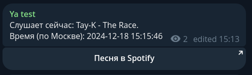
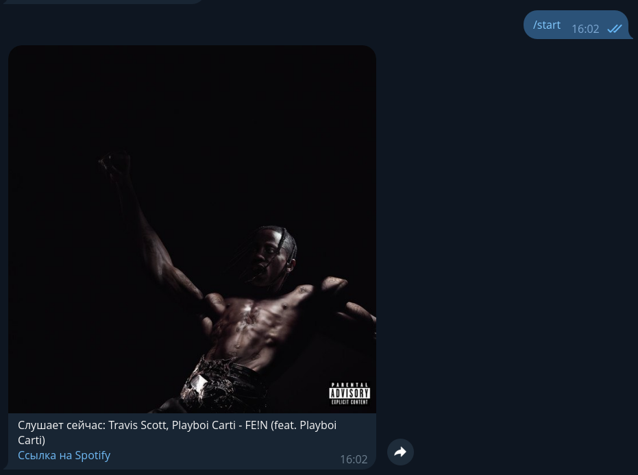

<p align="center">
    
</p>

# SpotifyMusicBot
Простой бот для отображения текущей песни.

# Как использовать?
Сначала, вам надо установить Python и зависимости бота.
<br>Позже - создать самого бота у BotFather и включить у него Inline Mode.

# Скачиваем SpotifyMusicBot
``` shell
git clone https://github.com/nnqnn/SpotifyMusicBot
```
# Вам надо быть в `ymmbbot` для дальнейшей работы
``` shell
cd SpotifyMusicBot
```

# Устанавливаем зависимости
# Допустим, вы уже установили python3
``` shell
pip install pip --upgrade
pip install -r requirements.txt
```

После этого вы должны заполнить `config.py`.
<br>После заполнения читайте следующую главу.

# Запускаем
```shell
python spoty.py
```
# Картинки-примеры
<table>
  <tr>
    <td>Сообщение от бота в канале</td>
    <td></td>
  </tr>
  <tr>
    <td>Ответ бота в личных сообщениях</td>
    <td></td>
  </tr>
</table>